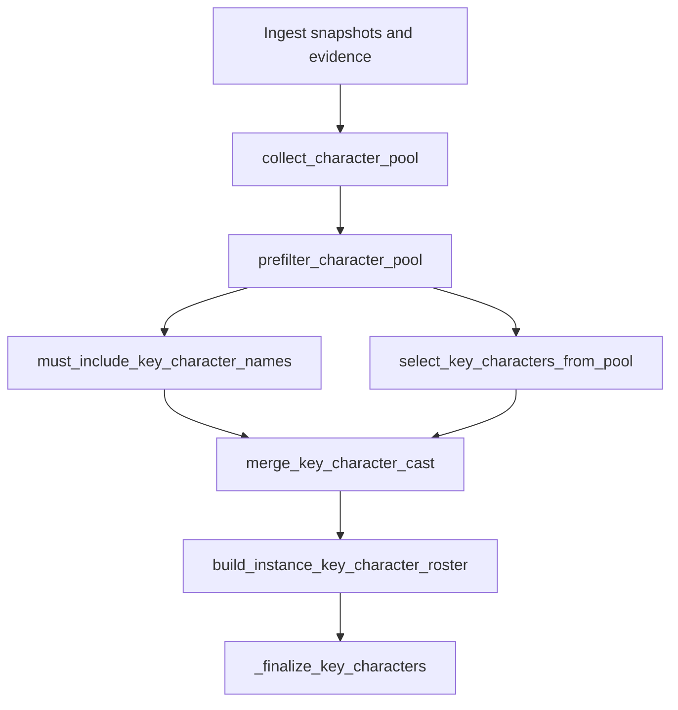

# Option F — S0 design lock

Status: **Locked** (2026-06-03). Plan-only session; implementation follows in S1–S3.

This document is the contract for instance `key_characters` cast selection using **Option F**: grounded LLM selection from a wiki-linked candidate pool, plus a deterministic **must-include floor** for structurally obvious bosses. Scholomance (`test-run-wpl-1`) is the proof run for S4 only — no zone or instance strings appear in logic or prompts.

**Related:** [instance-key-characters-migration-rfc.md](instance-key-characters-migration-rfc.md), canvas `instance-key-characters-fix-plan.canvas.tsx`, gold fixtures under `tests/fixtures/pilot/`.

---

## Locked policy decisions

| Topic | Decision |
|-------|----------|
| **Emit order** | `build_instance_key_character_roster` returns `BossCandidate` rows in **final cast order** (merge output). Legacy `_significance_score` does not drive emit (may remain for offline ordering only). |
| **Sidecar ranking** | **`merge_rank`**: integer `1` = first emitted card, `2` = second, … Only set when `emitted: true`; `null` otherwise. Legacy float `significance` (0–10) is **deprecated** in new runs; gold sidecar updated in S4. |
| **Cap overflow** | **Floor first:** must-include names fill slots 1…N up to `INSTANCE_MAX_KEY_CHARACTERS` (10); LLM fills **remaining** slots only. If floor alone exceeds 10, truncate floor at 10 (stable sort) and skip LLM for emit slots. |
| **Zone keywords** | Forbidden in logic and prompts. `scholomance_faculty` removed from code in S1. `faculty` is not a boss-class or tier signal. |
| **Card assembly** | `_finalize_key_characters` unchanged: summaries + `classify_key_character_role_llm` only when deterministic role is `uncertain`. |

Constants (from `pipeline/contracts/models.py`): `INSTANCE_MIN_KEY_CHARACTERS = 2`, `INSTANCE_MAX_KEY_CHARACTERS = 10`.

---

## Pipeline overview



| Stage | Session | Module (target) |
|-------|---------|-----------------|
| `collect_character_pool` | S1 | `pipeline/discovery/instance_bosses.py` |
| `prefilter_character_pool` | S1 | `instance_bosses.py` |
| `must_include_key_character_names` | S1 | `instance_bosses.py` |
| `select_key_characters_from_pool` | S2 | `pipeline/generate/draft/wiki_first_workers.py` |
| `merge_key_character_cast` | S3 | `pipeline/generate/draft/wiki_first.py` (or `instance_bosses.py`) |
| Sidecar `merge_rank` / `selection_reason` | S3 | `pipeline/generate/draft_writer.py` |
| Gold / quality gates | S4 | fixtures + `scripts/instance_quality_report.py` |

---

## 1. Merge — `merge_key_character_cast`

### Inputs

- **`pool`**: `list[BossCandidate]` after `prefilter_character_pool` (each has `name`, `wiki_url`, `boss_id`, `profile_pool`, `source_section_role`, …).
- **`must_include_names`**: `list[str]`, stable-sorted ascending by `normalize_title(name)`.
- **`llm_ordered_names`**: `list[str]` from LLM (already allowlisted ⊆ pool).
- **`max_count`**: `INSTANCE_MAX_KEY_CHARACTERS` (10).

### Outputs

- **`merged_names`**: `list[str]`, length ≤ `max_count`.
- **`selection_reasons`**: `dict[str, str]` mapping display name → `must_include_floor` | `llm_selected`.

### Algorithm

```text
pool_by_name = {candidate.name: candidate for candidate in pool}
merged = []
reasons = {}

for name in must_include_names:
    if name in pool_by_name and len(merged) < max_count:
        merged.append(name)
        reasons[name] = "must_include_floor"

for name in llm_ordered_names:
    if name in pool_by_name and name not in merged and len(merged) < max_count:
        merged.append(name)
        reasons[name] = "llm_selected"

return merged, reasons
```

### Mapping to roster

Walk `merged_names` in order. For each name, take the `BossCandidate` from `pool_by_name`. Attach to card `decision_reason_codes`:

- `must_include_floor` or `llm_selected`
- Existing role codes (`role:enemy:…`) from `classify_character_role` / LLM tie-break unchanged.

### Duplicate identity

Pool dedupe uses normalized wiki path (see `collect_boss_candidates` identity key: `path:{canonical}`). Merge dedupes by **display name in merged list**; floor reason wins if the same character would appear twice.

### Edge cases

| Case | Behavior |
|------|----------|
| Empty pool after prefilter | Return `[]`; skip LLM |
| Floor fills all 10 slots | Skip LLM call (optional optimization); emit floor only |
| LLM returns `[]` | Emit floor only (up to cap) |
| Name in both floor and LLM | Single entry; `selection_reason` = `must_include_floor` |
| Must-include name not in pool | Skip (floor never adds links not in pool) |
| Floor list > 10 | Take first 10 after stable sort; no LLM slots for emit |

---

## 2. Must-include floor — `must_include_key_character_names`

### Boss-class section tokens

A `boss_pool` evidence item qualifies when its `section_role` (normalized: lowercase, spaces → underscores) contains **any** of:

| Token | Notes |
|-------|--------|
| `boss` | Title "Bosses" as link target already rejected via `_REJECT_TITLES` |
| `encounter` | |
| `dungeon_journal` | |
| `adventure_guide` | |

**Explicitly not boss-class:** `faculty`, `denizen`, `inhabit`, `monster`, zone/instance slugs, pilot-specific exact roles (e.g. `scholomance_faculty` removed in S1).

### Computation

```text
boss_pool_names = valid_boss_names_from_pool_items(
    boss_pool_items,
    instance_name=instance_name,
    section_filter=is_high_confidence_boss_section,
)
must_include_names = sorted(
    [n for n in boss_pool_names if n in prefiltered_pool_names],
    key=normalize_title,
)
```

`is_high_confidence_boss_section(section_role)` returns true iff normalized role contains any boss-class token above.

---

## 3. Prefilter — `prefilter_character_pool` (S1)

Apply before floor and LLM:

1. `should_reject_boss_title(title, instance_name=…)` — registry kinds `place`, `zone`, `instance`, `continent`, `capital`, `region`; `_REJECT_TITLES`; instance self-title; dating convention regex.
2. No Scholomance-derived mob name deny lists.

### Prompt cap (default)

If `len(pool) > 40` after prefilter:

- Build LLM prompt candidate list from top 40 via deterministic pre-rank:
  1. `person` in `entry_kinds(title)`
  2. Multi-token proper names (existing capitalization heuristic)
  3. `_section_weight(source_section_role)` descending
  4. Name ascending
- **Always include** every `must_include_names` entry in the prompt even if outside the top 40.

---

## 4. LLM — `select_key_characters_from_pool` (S2)

### When to call

- After prefilter, when `len(pool) > 0` and `len(must_include_names) < INSTANCE_MAX_KEY_CHARACTERS`.
- If floor already fills 10 slots, **do not call** (emit is floor-only).

### Allowlist validation

- Build `allowed = {normalize_title(name): canonical_name for candidate in pool}`.
- Each `selected[]` entry from LLM must resolve through `allowed`; drop unknowns.
- Preserve LLM order for survivors.

### Trace

- `response_schema_name`: `wiki_first_key_character_pool_selection`
- `substep`: `wiki_first_key_character_pool_selection`

### Remaining slot count

```text
remaining_slots = INSTANCE_MAX_KEY_CHARACTERS - len(must_include_names)
```

Pass `max_count=remaining_slots` to the LLM (minimum 0 → skip call).

---

## 5. Sidecar — `instance_key_character_decisions.json`

Produced by `_build_key_character_decision_row` in `draft_writer.py` (S3 update).

### Per-instance row

```json
{
  "instance_id": "instance-scholomance",
  "candidates": [ ... ]
}
```

### Per-candidate fields (new runs)

| Field | Type | Description |
|-------|------|-------------|
| `name` | string | Display name |
| `role` | string | `enemy` \| `ally` \| `neutral` \| `uncertain` |
| `merge_rank` | int \| null | 1-based position in emitted cast; `null` if not emitted |
| `emitted` | bool | In final `key_characters` on page |
| `selection_reason` | string \| null | `must_include_floor` \| `llm_selected`; `null` if not emitted |

**Deprecated:** `significance` (float 0–10). Readers comparing old gold should treat it as legacy.

### Sidecar roster scope

List **all** prefiltered pool candidates (not only merged ten). Set `emitted` and `merge_rank` only for the merged cast.

---

## 6. Card `decision_reason_codes`

In addition to existing `role:…` codes on emitted cards:

| Code | Meaning |
|------|---------|
| `must_include_floor` | Included via boss-class boss_pool floor |
| `llm_selected` | Included via LLM order (remaining slots) |

---

## 7. NO_LLM fallback

When `WOW_LORE_WIKI_FIRST_NO_LLM` is set or OpenAI is not ready:

1. `must_include_names` — same as online.
2. `llm_ordered_names` = `deterministic_pool_order(remaining_candidates)` where `remaining` excludes names already in floor:
   - Primary: mention frequency in narrative + overview/at-a-glance text (reuse narrative miner ordering).
   - Tie-break: `_section_weight(source_section_role)` descending, then name ascending.
3. `merge_key_character_cast` — same as online.

No LLM for cast selection or significance.

---

## 8. Scholomance acceptance (S4)

Regression checklist for `artifacts/runs/test-run-wpl-1` (not hardcoded in code).

### Must emit (`key_characters`)

| Name | Source |
|------|--------|
| Darkmaster Gandling | Gold page |
| Rattlegore | Gold page |
| Jandice Barov | Gold page |
| Lord Alexei Barov | Gold page |

Alexei requires narrative/history links in `collect_character_pool` (S1); S0 locks him as required for S4.

### Must not emit

| Name | Failure mode (test-run-wpl-1) |
|------|-------------------------------|
| Caer Darrow | Registry `place` |
| Chamber of Summoning | Registry `place` |
| Viewing Room | Registry `place` |
| Acolyte | Generic denizen trash |
| Risen Guard | Generic denizen trash |
| Boneweaver | Generic denizen trash |
| Bored Student | Generic denizen trash |
| Candlestick Mage | Generic denizen trash |

### Sidecar only (may be candidates, not emitted)

- Kirtonos the Herald
- Ras Frostwhisper

### Known gap

- **Instructor Malicia** — defer if ingest has no `/wiki/Instructor_Malicia` href; do not fix with zone/instance keywords.

---

## 9. Handoff to S1

S1 implements (no merge, no LLM):

- `collect_character_pool` — roster + structured links + narrative/history + boss_pool harvest; dedupe by wiki path.
- `prefilter_character_pool`
- `must_include_key_character_names` + `is_high_confidence_boss_section` + `HIGH_CONFIDENCE_BOSS_SECTION` constant
- Remove `scholomance_faculty` from `_BOSS_SECTION_EXACT` in `instance_bosses.py`
- Tests: faculty HTML fixture + place rejection; must-include from boss-class boss_pool only

---

## Appendix A — LLM prompt (`select_key_characters_from_pool`)

### Response schema (JSON)

```json
{
  "selected": ["Name One", "Name Two"]
}
```

### System prompt (template)

```text
You select key characters for a World of Warcraft instance page.

Instance: {instance_name}

Task:
- Choose which candidates are key characters for this instance: notable bosses, enemy NPCs, and lore figures meaningfully tied to this dungeon/raid.
- Use ONLY names from the candidate list in the user message. Never invent or rename characters.
- Exclude factions, organizations, locations, subzones, items, and generic trash mobs.
- Order selected names by narrative importance (most important first).
- Return at most {max_count} names.

Output JSON only, matching the required schema.
```

### User prompt (template)

```text
Candidates (choose only from this list):

{for each candidate}
- name: {name}
  wiki: {wiki_url_or_path}
  sections: {comma-separated section_role values from snippets}
  evidence:
    - {snippet_1}
    - {snippet_2}
{end for}

{optional, if non-empty}
Instance context (from official/overview prose):
{overview_excerpt <= 800 chars}
```

### Example constraints (documentation only — do not embed pilot names in code)

The model should prefer named bosses and story figures over single-word mob titles (e.g. "Acolyte") when both appear in the list. No example text in production prompts may name Scholomance, Western Plaguelands, or specific zones.

---

## Appendix B — S0 exit checklist

- [x] Design doc written (`docs/planning/option-f-s0-design-lock.md`)
- [x] Merge overflow rule: floor first, truncate at 10
- [x] Sidecar fields: `merge_rank`, `selection_reason`; `significance` deprecated
- [x] LLM schema + allowlist rules documented
- [x] NO_LLM path documented
- [x] Scholomance must/must-not table documented
- [x] No open questions for S1 implementer (see handoff §9)

---

## Appendix C — Out of scope (S0)

- Python implementation (S1–S3)
- Gold fixture updates (S4)
- `instance_quality_report` rule changes (S4)
- Ingest/traverse changes (spike only if pool missing links)
